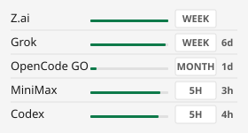

# PlanMeter

[](https://github.com/YangZhou91/CodingPlanTracker/actions/workflows/build.yml)

A compact, always-on-top Windows widget for **LLM coding-plan quota**. See how much of each plan is left this period — without opening five provider dashboards.



Each row is one plan. The bar is **remaining quota**. The chip is the window that is binding right now (`5H` / `WEEK` / `MONTH`). The number beside it is when that window resets.

## Providers

| Provider | How it authenticates |
|---|---|
| **Z.ai** | API key (Settings) |
| **Grok** | Device-code login (Settings) |
| **OpenCode GO** | API key (Settings) |
| **MiniMax** | API key (Settings) |
| **Codex** | Reuses `%USERPROFILE%\.codex\auth.json` (read-only) |

## Features

- Always on top, does not steal focus while you type
- Remaining-quota bar, window chip, and compact reset time
- Hover a row for used % and full reset timestamps
- Polls about every 10 minutes (manual refresh is available)
- Optional start-with-Windows from Settings
- Keys stored with Windows DPAPI; logs redact tokens
- No telemetry. Outbound traffic is allow-listed to the provider hosts only

## Requirements

- Windows 10 / 11
- [.NET 8 SDK](https://dotnet.microsoft.com/download/dotnet/8.0) to build

## Run

```bash
dotnet run --project src/PlanMeter.App
```

Right-click the widget → **Settings…** to add keys, log in to Grok, or enable providers.

## Build

```bash
dotnet publish src/PlanMeter.App/PlanMeter.App.csproj -c Release -r win-x64 --self-contained -p:PublishSingleFile=true -p:PublishReadyToRun=true -p:IncludeNativeLibrariesForSelfExtract=true
```

Or `pwsh scripts/publish-sign.ps1` for a signed single-file EXE.

## Privacy

PlanMeter never phones home. Manual keys live under `%LOCALAPPDATA%\PlanMeter\credentials\` as DPAPI blobs. Codex credentials are read from the local Codex CLI file and are never written back.
